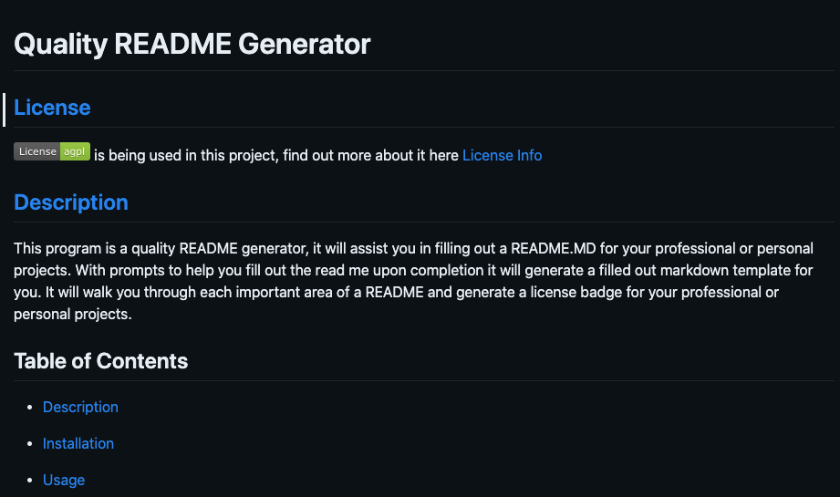
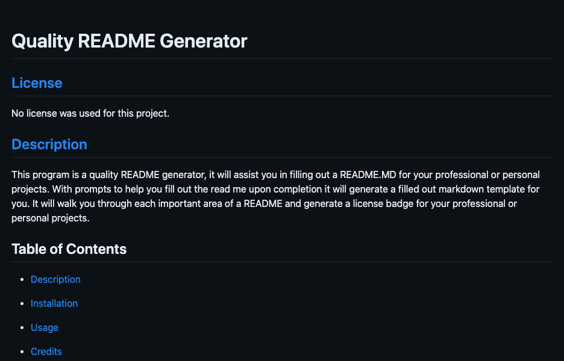

# Quality README Generator

## [License](#license)

No license was used for this project.

## [Description](#table-of-contents)

This program is a quality README generator, it will assist you in filling out a README.MD for your professional or personal projects. With prompts to help you fill out the read me upon completion it will generate a filled out markdown template for you. It will walk you through each important area of a README and generate a license badge for your professional or personal projects.

## Table of Contents

- [Description](#discription)
- [Installation](#installation)
- [Usage](#usage)
- [Credits](#credits)

- [Tests](#tests)
- [License](#license)
- [Questions](#questions)

## [Installation](#table-of-contents)

After installation is complete, run the following code: ‘node inex.js’ in the terminal. Answer the prompts and after completion, you should see a console log showing your answers to your prompts, a message that says `Successfully created README.md!` and the file will be under the 'utils' folder named 'README.md' it will be generated in a markdown format syntax for you to copy, paste, and edit for your projects.

## [Usage](#table-of-contents)

Upon cloning the repository in your preferred method into a directory of your choice using the terminal. Open VS code or your preferred work environment and confirm you're in the root directory of 'Node.JS-README.MD-Generator' At this point you'll need to NPM.js to instal the fallowing dependencies, use the fallowing commands. 'npm i' and 'npm i node' after that you should be ready to run this program.

Here is the compleated README.MD with License and badge info.

And here is the is the compleated README.MD with out the License and badging!

## [credits](#table-of-contents)

N/A

Thank you for your interest in helping out; however, I will not be accepting contributions from third parties.

## [Tests](#table-of-contents)

To test this app, open up the file in VS Code or your preferred work environment. Open the terminal, and run the code from the root directory by using the fallowing ‘node index.js’. Answer the prompts and view the preview of the ‘README.md’ file in the ‘until’ folder.

## [Questions](#table-of-contents)

Please contact me using the following links:
[GitHub](https://github.com/Philippwinston)
[Email: Philippwinston](mailto:Philippwinston)

---
